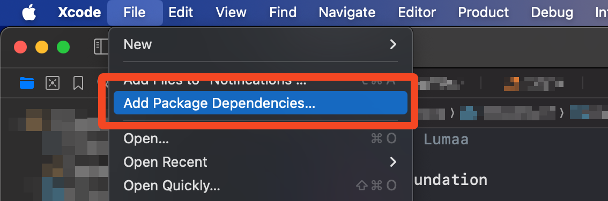

# ProboscisKit

ProboscisKit is a lightweight Mastodon swift package.

A derivative is used in [Bubble](https://apps.lumaa.fr/app/bubble)

ProboscisKit is fully working, the only missing part is the documentation. Soon to be released...

---

# How to start

To start using ProboscisKit, you will have to import it using Xcode's Swift Package Manager, by going in **File > Add Package Dependencies...**



Then, you can simply paste the [GitHub link](https://github.com/lumaa-dev/ProboscisKit) into the search bar at the top right of the window, and then click on **Copy Dependency**.

Once this is done, congrats! You successfully added ProboscisKit to your project.

## Recognize an instance

To know if a certain URL is a real Mastodon instance or not, you will need to do the following

```swift
func isInstance(_ url: URL) async -> Bool {
    let client: Client = .init(server: url)
            
    do {
        let instance: Instance = try await client.get(endpoint: Instances.instance)
        return true // If the URL wasn't a Mastodon instance, it would throw an error
    } catch {
        print("\(instanceUrl) Error: \(error)") // It's always good to keep a error log here
        return false
    }
}
```

---

# Credits

- [Lumaa](https://lumaa.fr/)

- [Dimillian (Thomas Ricouard)](https://github.com/Dimillian)
